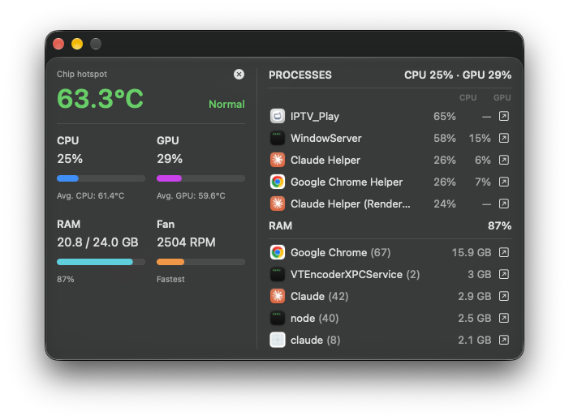

# ThermoBar

ThermoBar is a lightweight macOS menu bar app that displays your Mac's current
resource usage and thermal condition. It runs entirely locally, sends no
telemetry, and requires neither an account nor an Internet connection.



## Features

- floating panel and menu bar interface;
- CPU, GPU, and memory usage;
- average CPU and GPU temperatures, plus the hottest sensor reading;
- current speed of the fastest fan in RPM;
- macOS system thermal state;
- top five processes by CPU usage, with their GPU share, and top five apps by
  memory footprint, each with a shortcut to Activity Monitor;
- options to hide the process and memory lists;
- adjustable floating panel opacity;
- sensor diagnostics with a retry action;
- English and Polish interface, following the macOS language order;
- optional local notifications for serious and critical thermal conditions;
- optional launch at login;
- adaptive sampling based on panel visibility and Mac sleep state.

ThermoBar is read-only. It does not change fan speeds or write values to
AppleSMC.

## Requirements

- macOS 27.0 or later;
- Xcode 27;
- Apple Silicon.

Full access to private sensors is currently verified only on `Mac17,9`. The
sensor-key allowlist is tied to the Mac model rather than to a specific macOS
build. Every reading is checked at runtime: SMC temperature and fan values must
come from the expected key with the expected data type, size, and a plausible
value range, and GPU utilization from the IOAccelerator registry must fall
between 0 and 100%. A reading that fails these checks, for example after a
system update changes a sensor key, is shown as unavailable rather than guessed.
On an unverified model ThermoBar disables temperature, GPU, and RPM readings.
Public CPU, memory, and macOS thermal-state metrics remain available.

## Build

1. Open `ThermoBar.xcodeproj` in Xcode.
2. Build and run the `ThermoBar` scheme.

The project signs the app to run locally, so no Apple developer account is
needed. To sign with your own team, select it under *Signing & Capabilities*.

To install, build the Release configuration and copy `ThermoBar.app` to
`/Applications`. Launch at login is meant to be used from there.

After launch, the ThermoBar icon appears in the menu bar. Click it to show or
hide the floating panel and to change settings.

Notifications require macOS permission. Enabling launch at login may require
confirmation in **System Settings → General → Login Items & Extensions**.

## Privacy and security

- no external SwiftPM dependencies;
- no networking, telemetry, or analytics;
- no subprocesses, XPC, or privileged helper;
- Release builds use the hardened runtime and have no entitlements;
- read-only AppleSMC access using an exact sensor-key allowlist for the
  supported model;
- process names, paths, and resource usage are read only while the floating
  panel is visible and are never logged or written to disk; the process lists
  are cleared when the panel is hidden or the Mac goes to sleep;
- preferences are stored locally in `UserDefaults`.

## Project layout

- `ThermoBar/` — the app: SwiftUI views, menu bar and panel windows, preferences,
  notifications, and the string catalog;
- `ThermoBarTests/` — app tests, run inside the app by Xcode;
- `Packages/ThermoBarCore/` — sensor, CPU, memory, GPU, and process readers and
  the sampling logic, as a local Swift package with its own tests.

## Tests

In Xcode, **Product → Test** (⌘U) runs the app tests. The same from the command
line:

```bash
xcodebuild test -project ThermoBar.xcodeproj -scheme ThermoBar
```

The ThermoBarCore tests run with Swift Package Manager, or in Xcode after opening
`Packages/ThermoBarCore/Package.swift`:

```bash
cd Packages/ThermoBarCore
swift test
```

Additional quality gates, run from `Packages/ThermoBarCore`:

```bash
swift test --sanitize=thread
THERMOBAR_RUN_LIVE_SENSORS=1 swift test --filter Live
THERMOBAR_LIVE_CONSUMER_READER=1 THERMOBAR_LIVE_GPU_CLIENT_READER=1 swift test --filter 'liveReaderReturnsOnlySafeRecordsWhenEnabled|liveGPUClientReaderReturnsOnlyValidCountersWhenEnabled'
THERMOBAR_RUN_PERFORMANCE=1 swift test -c release --filter SensorReadPerformanceTests
```

The `Live` tests and performance benchmark are intended for the supported Mac
model. The two live process-reader tests read the processes running on the
current Mac.

## Third-party information

The project has no executable third-party dependencies. Attribution for the
source used to understand the AppleSMC ABI layout is provided in
[`THIRD_PARTY_NOTICES.md`](THIRD_PARTY_NOTICES.md).
